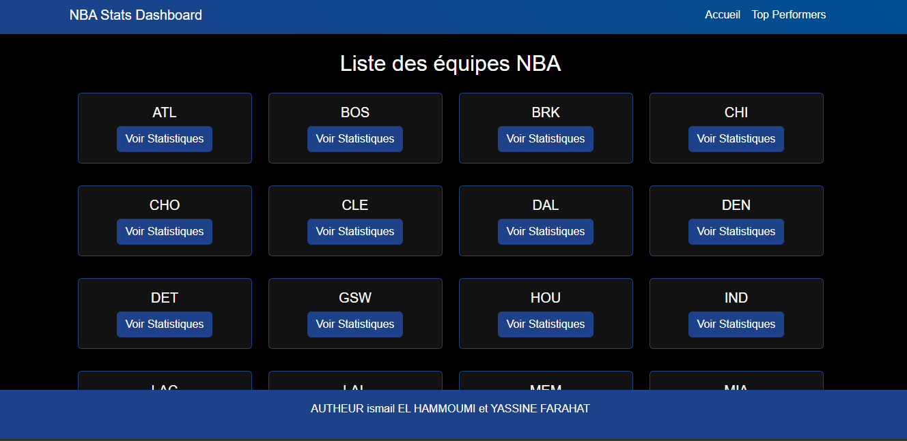
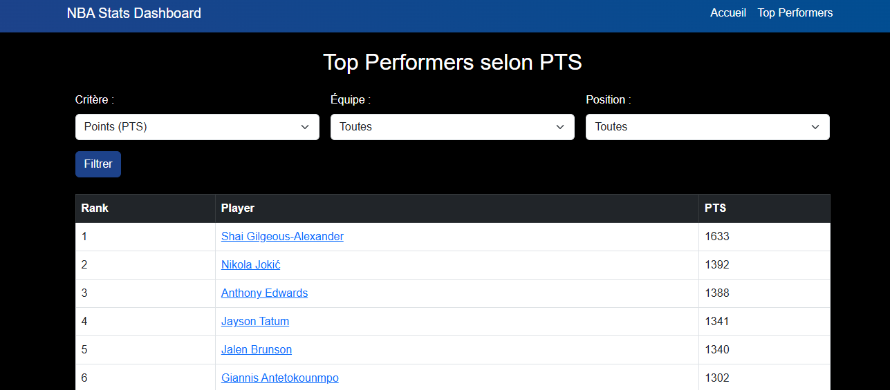
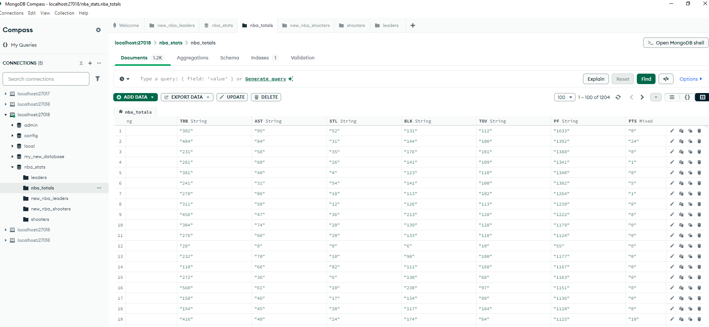
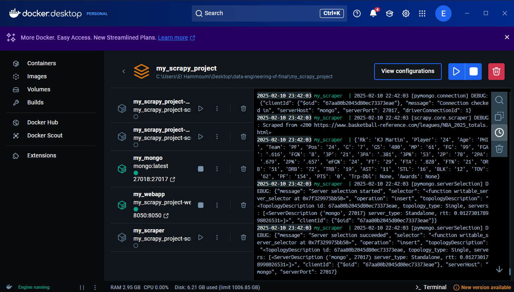

# NBA Stats Dashboard

## Auteurs
**Ismail EL HAMMOUMI** et **Yassine FARAHAT**

## Description du Projet
Ce projet est une application web interactive permettant d'explorer les statistiques des joueurs de la NBA. Il repose sur un système de scraping de données en utilisant **Scrapy**, un stockage des données dans **MongoDB**, et un affichage dynamique grâce à **Flask** et **Bootstrap**. Le projet est entièrement déployé à l'aide de **Docker**, garantissant un environnement isolé et reproductible.

## Architecture du Projet

### 1. **Scraping des données**
Le scraping des données est effectué avec **Scrapy**, qui extrait les statistiques des joueurs depuis "Basketball Reference". Les spiders suivants sont utilisés :
- `nba_leaders.py` : Récupère les statistiques des meilleurs joueurs NBA.
- `nba_shooters.py` : Extrait les performances de tirs des joueurs.
- `nba_totals.py` : Récupère les statistiques globales de la saison pour chaque joueur.

Les données extraites sont ensuite stockées dans **MongoDB**, exécuté dans un conteneur Docker.

### 2. **Stockage des données**
L'application utilise **MongoDB** pour stocker les données collectées. Grâce à **Docker Compose**, un service MongoDB est lancé et utilisé par l'application web pour récupérer les statistiques en temps réel.

Les collections MongoDB utilisées sont :
- `new_nba_leaders`
- `new_nba_shooters`
- `nba_totals`

### 3. **Application Web**
L'application est développée avec **Flask** et permet d'afficher les données sous forme de tableaux et de graphiques interactifs. Les principales fonctionnalités incluent :
- **Page d'accueil** : Affichage des équipes NBA disponibles.
- **Top Performers** : Classement interactif des meilleurs joueurs selon divers critères.
- **Page Équipe** : Affichage des statistiques des joueurs d'une équipe avec filtres dynamiques.
- **Page Joueur** : Affichage détaillé des statistiques d'un joueur spécifique.

## Installation et Exécution
### **Prérequis**
- Docker et Docker Compose installés sur votre machine.
- Git installé pour récupérer le projet.
- Python installé avec la gestion d’environnement virtuel `venv`.

### **Cloner le projet**
```bash
git clone https://github.com/elhammoi/data-engineering-vf-final
cd my_scrapy_project
```

### **Créer et activer un environnement virtuel**
```bash
python -m venv venv
source venv/bin/activate   # Sur macOS/Linux
venv\Scripts\activate     # Sur Windows
```

### **Installer les dépendances**
#### Pour l’application web :
```bash
pip install -r webapp/requirements.txt
```
#### Pour le scraping :
```bash
pip install -r my_scrapy_project/requirements.txt
```

### **Lancer l'application avec Docker Compose**
```bash
docker-compose up --build -d
```
Cela démarre trois services :
1. **MongoDB** : Base de données pour stocker les statistiques NBA.
2. **Scraper** : Exécute les spiders Scrapy pour collecter les données.
3. **WebApp** : Lance l'interface Flask accessible à l'adresse `http://127.0.0.1:8050/`.

## Fonctionnalités Clés
### **Scraping Automatisé**
Les spiders Scrapy s'exécutent automatiquement à chaque démarrage du projet pour récupérer les dernières données des joueurs NBA. Ces données sont stockées dans **MongoDB**.

### **Exploration des Statistiques**
- **Filtrage interactif** : L'utilisateur peut filtrer les joueurs par équipe, position ou critère spécifique.
- **Classement dynamique** : Un classement des joueurs est généré selon des critères comme les points (PTS), rebonds (TRB), passes (AST), etc.
- **Graphiques interactifs** : Les performances des joueurs peuvent être visualisées sous forme de graphiques interactifs.

## Structure du Projet
```plaintext
my_scrapy_project/
├── docker-compose.yml  # Configuration des services Docker
├── dockerfile          # Dockerfile pour le scraper
├── requirements.txt    # Dépendances Python
├── result.json         # Résultats du scraping
├── scrapy.cfg          # Configuration Scrapy
├── my_scrapy_project/  # Code Scrapy
│   ├── spiders/        # Scripts de scraping
│   │   ├── nba_leaders.py
│   │   ├── nba_shooters.py
│   │   ├── nba_totals.py
│   ├── pipelines.py    # Envoi des données à MongoDB
├── webapp/             # Application Flask
│   ├── app.py          # Code Flask principal
│   ├── templates/      # Fichiers HTML pour l'affichage
│   │   ├── base.html
│   │   ├── index.html
│   │   ├── player.html
│   │   ├── team.html
│   │   ├── top_performers.html
```

## Accès à la Base de Données MongoDB
Vous pouvez inspecter les données stockées dans MongoDB en lançant un shell MongoDB :
```bash
docker exec -it my_mongo mongosh
```
Puis afficher les collections disponibles :
```bash
show collections
```
Pour voir les données de `nba_totals` :
```bash
db.nba_totals.find().pretty()
```

## Dépendances du Projet
### **Web Application**
```
flask
flask_pymongo
pandas
plotly
gunicorn==20.1.0
pymongo==4.3.3
```

### **Scraping**
```
Flask
pymongo
scrapy
```

## Aperçu du Dashboard
### **Vue de l’Accueil**


Cette page permet de naviguer entre les différentes équipes NBA et d’accéder aux statistiques détaillées de chaque équipe.

### **Vue des Top Performers**


Cette page permet d'afficher un classement des meilleurs joueurs selon un critère sélectionné (PTS, TRB, AST, etc.), avec possibilité de filtrer par équipe et par position.

## Interface MongoDB


L’interface MongoDB Compass permet de visualiser les données stockées dans la base MongoDB et de vérifier leur intégrité.

## Interface Docker


L’interface Docker Desktop permet de voir les différents conteneurs en cours d'exécution, garantissant que l’application fonctionne correctement.

## Conclusion
Ce projet illustre l'utilisation combinée de **Scrapy**, **MongoDB**, **Flask**, et **Docker** pour collecter, stocker et afficher des statistiques NBA de manière interactive. Il fournit une base solide pour développer des applications analytiques dans le domaine du sport et des données statistiques.

